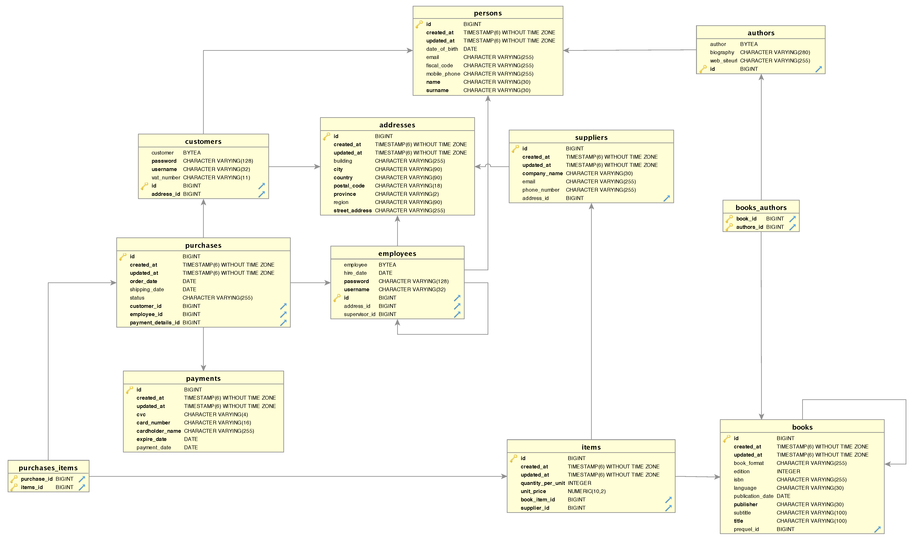

# Booktique

**Booktique** is a system that implements an online book store.

#### Repository

The source code is available on GitLab at
[https://gitlab.com/GiorgiaAuroraAdorni/3rdAssignment/](https://gitlab.com/GiorgiaAuroraAdorni/3rdAssignment/).

#### Contributors

This project has been developed by Giorgia Adorni (806787) .

## Installation

```
$ git clone https://gitlab.com/GiorgiaAuroraAdorni/3rdAssignment.git
$ cd booktique
$ docker-compose up
```

An alternative to `docker-compose up` is the command `docker-compose up --build` that allows the rebuild of the app.  
The database is available at <http://localhost:5432/>, (you can find the necessary credentials to access to pgAdmin and interact with the model in the `docker-compose.yml`).

Docker Compose also allows to locally run the unit tests:

```
$ docker-compose run app mvn test
```

It is also possible to generate the API References using Javadoc:

```
$ mvn javadoc:javadoc
$ mvn javadoc:test-javadoc
```

## Containerization

The application is composed of two main components:

- **app:** the Java application, developed using the Spring Boot Maven plugin, that provides many convenient features such as the built-in dependency resolver, and the ORM Hibernate.
- **database:** a PostgreSQL instance responsible for persistently storing the users data.

No web interface has been created.

Docker is used to containerize each of the two components, allowing to simplify the setup process of the development environment creating images that contain all dependencies needed.

The Docker-compose produces three images: db, pgAdmin and the application.


#### Entities

The model is composed of 9 entities:

- **book** - items available in the online store. The book object provides a set of information such as title, ISBN, authors, publisher, format etc. A unique id is used as the primary key, despite this the ISBN provides a perfect primary key because every book has a different ISBN.

- **person** - a real person. The person object provides personal information such as name, surname, fiscal code, date of birth, email and telephone number. A unique id is used as a primary key, in addition the fiscal code is marked as a natural identifier as it identifies a person in the real world.

  <!-- If a **person** object is deleted, -->

- **author** - the author of the book. Because an author is also a person, the object inherits the same attributes of the person superclass. More information about the author is provided, for example an optional biography and the web site URL.

- **customer** – people who buy  books in the online store. Every customer has a basic set of data inherits from the person superclass such as for the authors. Mandatory attributes, such as login credentials and postal address, is added to customers, but can be also provided VAT number.

- **employee** – is a person who carries out activities related to orders. An employee has the same properties of its parent class, in addition he is associated whit another employee as a supervisor. More information about the employee is given, such as the login credentials, the hire date and his postal address.

- **supplier** - organization that provides book to the online store. To the supplier object is associated a unique id as primary key, the company name and other information such as email, telephone number and postal address.

- **item** – articles selected by the customer for purchase in online store. To each item is assigned the reference to the book in the catalog that the customer want to buy, its unit price, the desired quantity and its supplier.

- **purchase** - items ordered. To every purchase is associated a hypothetically unlimited number of items, the customer, the employee who takes charge of the order, order and shipping dates, the total amount,  order status and the transaction information (payment type and date).

- **address** - postal information about customer and supplier. In this object is stored the street address, the postal code, the city, region and country name.

#### Relationships

Between those entities ther's 14 relations, in particular:

- two self-relations: the first one is a One-to-One relation between a book and his prequel, inand in the other between the book and his sequel; the second is a Many-to-One relation between employees and supervisor (each employee is associated with only one supervisor).
- one relation Many-to-Many between books and authors, handled with lazy load. <!-- (spiegare dell'altra tabella generata)-->
- one inheritance hierarchy that involves 4 entities:  the class person serves as a superclass for employee, author and customer subclass.  
  <!-- modified --> All entities will also inherit from a Auditable abstract class that provides the `createdDate` and `modifiedDate` attributes using **JPA Auditing**. This allows to track changes to the entities made from the Java application.



<!--rigenerare l'immagine -->


